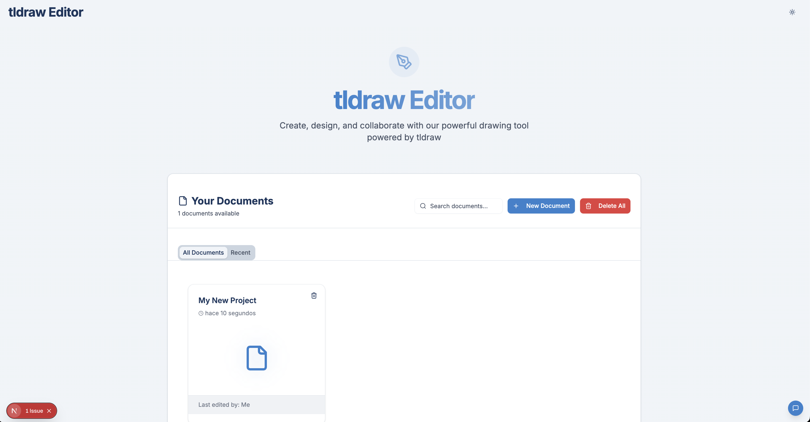

# TLDraw Editor

A simple yet powerful drawing editor built with Next.js, tldraw, and tRPC.



## Technologies Used

- **Next.js 15**: React framework for server-rendered applications
- **React 18**: JavaScript library for building user interfaces
- **tldraw**: Drawing and diagramming tool
- **tRPC**: End-to-end typesafe API layer
- **TailwindCSS**: Utility-first CSS framework
- **Shadcn UI**: Reusable UI components
- **Node.js 22**: JavaScript runtime
- **pnpm**: Fast, disk space efficient package manager
- **AI SDK**: Basic OpenAI chat integration

## Installation and Setup

### Prerequisites

- Node.js 22 or later
- pnpm (recommended) or npm/yarn
- OpenAI API Key (for AI features)

### Step 1: Clone the Repository

```bash
git clone https://github.com/nashmonzon/My-tldraw-project.git
cd tldraw-editor
```

### Step 2: Install Dependencies

Using pnpm (recommended):

```shellscript
pnpm install
```

Alternative package managers:

```shellscript
# Using npm
npm install

# Using yarn
yarn install
```

### Step 3: Configure Environment Variables

Create a `.env.local` file in the root directory:
```env
OPENAI_API_KEY=sk-your-api-key-here
```
**Note**: AI features will only be available with a valid OpenAI API key. The application will work normally without it, but AI capabilities will be disabled.


### Step 4: Run the Development Server

```shellscript
pnpm run dev
```

The application will be available at [http://localhost:3000](http://localhost:3000).

## Project Structure

```plaintext
tldraw-editor/
├── app/                  # Next.js app directory
│   ├── actions/          # Server actions for document operations
│   ├── api/             # API routes
│   │   └── trpc/        # tRPC API endpoints
│   ├── editor/          # Editor page
│   └── page.tsx         # Home page
├── components/          
│   ├── chat-ia/         # AI chat components
│   ├── homepage/        # Home page components
│   ├── ui/              # Shadcn UI components
│   └── editor-page.tsx  # Editor page component
├── lib/                 
│   ├── document-store.ts # Document storage logic
│   └── trpc/            # tRPC configuration
└── public/              # Static assets
```

## Using the Application

1. **Home Page**
   - View all your documents in a grid layout
   - Create new documents using the "New Document" button
   - Search and filter existing documents
   - Click any document to open it in the editor

2. **Editor**
   - Access the editor by clicking on any document from the home page
   - Use tldraw's interface to create and edit drawings
   - Create new shapes and modify existing ones
   - All changes are automatically saved
   - Basic AI chat available (requires API key)

 ## Testing the API

The application uses a combination of tRPC and Server Actions for its backend operations:

### Method 1: Using the Browser Developer Tools

1. Open your browser's developer tools (F12 or Right-click > Inspect)
2. Go to the Network tab
3. You can monitor:
   - tRPC requests (filter by "trpc")
   - Server Action calls
   - AI SDK interactions
4. Examine the request/response data in the console


### Updating Dependencies

To update all dependencies to their latest versions:

```shellscript
pnpm update
```
