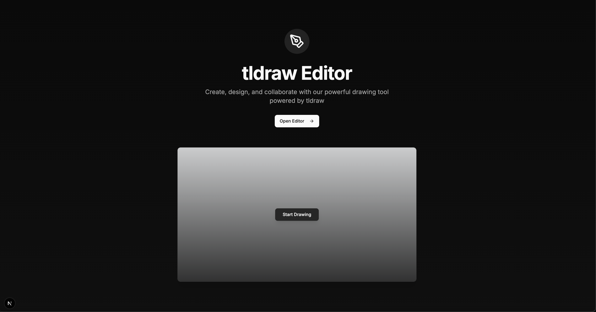

# TLDraw Editor

A simple yet powerful drawing editor built with Next.js, tldraw, and tRPC.



## Technologies Used

- **Next.js 15**: React framework for server-rendered applications
- **React 18**: JavaScript library for building user interfaces
- **tldraw**: Drawing and diagramming tool
- **tRPC**: End-to-end typesafe API layer
- **TailwindCSS**: Utility-first CSS framework
- **Shadcn UI**: Reusable UI components
- **Node.js 22**: JavaScript runtime
- **pnpm**: Fast, disk space efficient package manager

## Installation and Setup

### Prerequisites

- Node.js 22 or later
- pnpm (recommended) or npm/yarn

### Step 1: Clone the Repository

````bash
git clone https://github.com/nashmonzon/My-tldraw-project.git
cd tldraw-editor
````

### Step 2: Install Dependencies

Using pnpm (recommended):

```shellscript
pnpm install
````

Alternative package managers:

```shellscript
# Using npm
npm install

# Using yarn
yarn install
```

### Step 3: Run the Development Server

```shellscript
pnpm run dev
```

The application will be available at [http://localhost:3000](http://localhost:3000).

## Project Structure

```plaintext
tldraw-editor/
├── app/                  # Next.js app directory
│   ├── api/              # API routes
│   │   └── trpc/         # tRPC API endpoints
│   │       └── [trpc]
│   │           └── route.ts
│   ├── editor/           # Editor page
│   │   └── page.tsx
│   ├── error.tsx         # Error page
│   ├── global.css        # Global styles
│   ├── layout.tsx        # Application layout
│   ├── loading.tsx       # Loading indicator
│   └── page.tsx          # Home page
├── components/           # React components
│   ├── ui/               # Shadcn UI components
│   ├── editor-page.tsx   # Editor page component
│   ├── error-boundary.tsx# Error boundary component
│   └── loading-spinner.tsx # Loading spinner component
├── lib/                  # Utility functions
│   └── trpc/             # tRPC configuration
│       ├── client.tsx    # tRPC client configuration
│       └── server.ts     # tRPC routers
│   └── util.ts           # Additional utility functions
└── public/               # Static assets
```

## Using the Application

1. Open your browser and navigate to [http://localhost:3000](http://localhost:3000)
2. Click on "Open Editor" to access the drawing canvas
3. Use the tldraw interface to create and edit drawings
4. Create a New Shape: You can add new shapes to the canvas using the button Add Square.
5. Modify Selected Shapes: If a shape is selected, you can modify its properties, such as color and size using the button Modify Shape.
6. Changes are automatically saved or using the button Save

## Testing the API

The application uses tRPC for type-safe API calls between the client and server. You can test the API endpoints using the followin method:

### Method 1: Using the Browser Developer Tools

1. Open your browser's developer tools (F12 or Right-click > Inspect)
2. Go to the Network tab
3. Filter for "trpc" requests
4. Interact with the editor to see API calls being made
5. Examine the request/response data

### Updating Dependencies

To update all dependencies to their latest versions:

```shellscript
pnpm update
```
